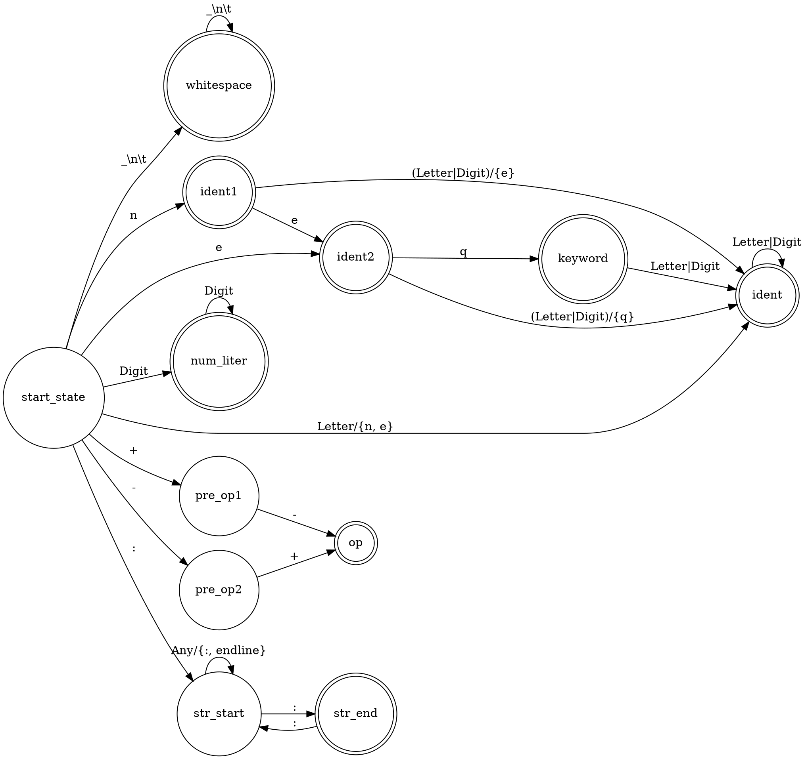

% Лабораторная работа № 1.4 «Лексический распознаватель»
% 25 марта 2024 г.
% Андрей Марченко, ИУ9-62Б

# Цель работы
Целью данной работы является изучение использования детерминированных конечных автоматов с 
размеченными заключительными состояниями (лексических распознавателей) для решения задачи 
лексического анализа.

# Индивидуальный вариант
eq, neq, +-, -+, строковые литералы ограничены знаками :, для включения двоеточия в строку
оно удваивается, не могут пересекать границы строк текста.

# Реализация

Лексическая структура языка — регулярные выражения для доменов:

* WHITESPACE := [\\t\\r\\n\\s]+
* IDENT := [a-zA-Z][a-zA-Z0-9]*
* NUM_LITERAL := [0-9]+
* KEYWORD := [eq|neq]
* OPERATIONS := [+-|-+]
* STRING_LITER := :(?:::|[^:]+)*:

Граф детерминированного распознавателя:



Реализация распознавателя:

Файл `Main.java`:
```java
import java.io.IOException;
import java.nio.file.Files;
import java.nio.file.Path;
import java.nio.file.Paths;
import java.util.ArrayList;

public class Main {

    static Integer[][] table = {
            /*     Wh,Di,Lt, +, -, n, e, q, :,Any, EndLine */
            /*0*/  {1, 6, 4, 7, 8, 2, 3, 4,10,12, 1}, // Start
            /*1*/  {1,-1,-1,-1,-1,-1,-1,-1,-1,12, 1}, // WhiteSpace
            /*2*/  {-1, 4,4,-1,-1, 4, 3, 4,-1,12, -1}, // Ident1
            /*3*/  {-1, 4,4,-1,-1, 4, 4, 5,-1,12, -1}, // Ident2
            /*4*/  {-1, 4,4,-1,-1, 4, 4, 4,-1,12, -1}, // Ident
            /*5*/  {-1, 4,4,-1,-1, 4, 4, 4,-1,12, -1}, // Keyword
            /*6*/  {-1,6,-1,-1,-1,-1,-1,-1,-1,12, -1}, // NumLiter
            /*7*/  {-1,-1,-1,-1,9,-1,-1,-1,-1,12, -1}, // PreOp_1
            /*8*/  {-1,-1,-1,9,-1,-1,-1,-1,-1,12, -1}, // PreOp_2
            /*9*/  {-1,-1,-1,-1,-1,-1,-1,-1,-1,12,-1}, // Op
            /*10*/ {10,10,10,10,10,10,10,10,11,10, 12}, // Str_Start
            /*11*/ {-1,-1,-1,-1,-1,-1,-1,-1,10,12,-1}, // String_Literal
            /*12*/ {-1,-1,-1,-1,-1,-1,-1,-1,-1,12, -1}, // Error
    };

    static int numberColumn(Position ch){
        if (ch.isEOF())
            return -1;
        else if (ch.isNewLine()) {
            return 10;
        }
        else if (ch.isWhitespace()) {
            return 0;
        }
        else if (Character.isDigit(ch.getCode())) {
            return 1;
        }
        else if (ch.getCode() == '+') {
            return 3;
        }
        else if (ch.getCode() == '-') {
            return 4;
        }
        else if (ch.getCode() == 'n') {
            return 5;
        }
        else if (ch.getCode() == 'e') {
            return 6;
        }
        else if (ch.getCode() == 'q') {
            return 7;
        }
        else if (ch.getCode() == ':') {
            return 8;
        }
        else if (Character.isLetter(ch.getCode())) {
            return 2;
        }
        else {
            return 9;
        }
    }

    static final ArrayList<DomainTag> final_state = new ArrayList<>() {{
        add(DomainTag.WHITESPACE);
        add(DomainTag.IDENT_1);
        add(DomainTag.IDENT_2);
        add(DomainTag.IDENT);
        add(DomainTag.KEYWORD);
        add(DomainTag.NUM_LITER);
        add(DomainTag.OP);
        add(DomainTag.STR_LITERAL);
        add(DomainTag.ERROR);
    }};


    public static void main(String[] args) throws IOException {

        String text_program = new String(Files.readAllBytes(Path.of("text.txt")));

        Position cur = new Position(text_program);

        ArrayList<Token> tokens = new ArrayList<>();
        ArrayList<ErrorMessage> errorMessages = new ArrayList<>();

        Position start,end;
        int state,prev_state;

        System.out.println("TOKENS:");
        while(!cur.isEOF()){
            while (cur.isWhitespace())
                cur = cur.next();
            state = 0;
            prev_state = 0;
            start = new Position(cur);
            while (state != -1) {
                int symbols = numberColumn(cur);
                prev_state=state;
                state = (symbols == -1) ? -1: table[state][symbols]; // переходим в следующее состояние
                if(state!=-1){
                    cur = cur.next();  // пока можем идти, идём дальше
                }
            }
            if (prev_state!=1 && prev_state!=0 && prev_state!= 15){
                end = new Position(cur);
                if (prev_state==12)
                    errorMessages.add(new ErrorMessage(true,
                            "error: \":\" expected at the end of previous line",cur));
                else if (!final_state.contains(DomainTag.values()[prev_state]) && 
                        DomainTag.values()[prev_state] == DomainTag.STR_START)
                    errorMessages.add(new ErrorMessage(true,
                            "error: expected \":\" at the end of string literal",cur));
                else if (!final_state.contains(DomainTag.values()[prev_state]))
                    errorMessages.add(new ErrorMessage(true,"error: unknown token \"" + 
                            text_program.substring(start.getIndex(),end.getIndex()) + "\"",cur));
                else
                    tokens.add(new Token(DomainTag.values()[prev_state],
                            text_program.substring(start.getIndex(),end.getIndex()),start,end));
            }
            else {
                while (!cur.isEOF() && numberColumn(cur) == -1) {
                    cur = cur.next();
                }
                end=new Position(cur);
                errorMessages.add(new ErrorMessage(true,"error: unknown token \"" + 
                        text_program.substring(start.getIndex(),end.getIndex()) + "\"",cur));
            }
        }

        for(Token token: tokens)
            System.out.println(token);

        if (!errorMessages.isEmpty()) {
            System.out.println("Errors:");
            for(ErrorMessage mes: errorMessages)
                System.out.println(mes.toString());
        }
    }
}
```

Файл `Token.java`:
```java
public class Token {
    public final DomainTag tag;
    public final Fragment coords;

    public String value;

    protected Token(DomainTag tag, String value, Position starting, Position following) {
        this.tag = tag;
        this.value = value;
        this.coords = new Fragment(starting, following);
    }

    @Override
    public String toString() {
        if (tag == DomainTag.STR_LITERAL) {
            value = value.substring(1, value.length() - 1);
            value = value.replaceAll("::", ":");
        }
        if (tag.name().contains("IDENT"))
            return "IDENT" + " " + coords.toString() + ": " + value;
        else
            return tag.name() + " " + coords.toString() + ": " + value;
    }
}

```

Файл `Position.java`:
```java
public class Position {
    private String text;

    private int line,pos,index;

    public String getText() {
        return text;
    }

    public int getLine() {
        return line;
    }

    public int getPos() {
        return pos;
    }

    public int getIndex() {
        return index;
    }

    public Position(String text) {
        this.text = text;
        line = pos = 1;
        index = 0;
    }

    public Position(Position p) {
        this.text  = p.getText();
        this.line  = p.getLine();
        this.pos   = p.getPos();
        this.index = p.getIndex();
    }


    @Override
    public String toString() {
        return "(" + line + " ," + pos + ')';
    }

    public boolean isEOF() {
        return index == text.length();
    }

    public int getCode() {
        return isEOF() ? -1 : text.codePointAt(index);
    }

    public boolean isWhitespace() {
        return !isEOF() && Character.isWhitespace(getCode());
    }


    public boolean isNewLine() {
        if (index == text.length()) {
            return true;
        }

        if (text.charAt(index) == '\r' && index+1 < text.length()) {
            return (text.charAt(index + 1) == '\n');
        }

        return (text.charAt(index) == '\n');
    }

    public Position next() {
        Position p = new Position(this);
        if (!p.isEOF()) {
            if (p.isNewLine()) {
                if (p.text.charAt(p.index) == '\r')
                    p.index++;
                p.line++;
                p.pos = 1;
            } else {
                if (Character.isHighSurrogate(p.text.charAt(p.index)))
                    p.index++;
                p.pos++;
            }
            p.index++;
        }
        return p;
    }


}

```
Файл `DomainTag.java`:
```java
enum DomainTag {
    /*0*/ START,
    /*1*/ WHITESPACE,
    /*2*/ IDENT_1,
    /*3*/ IDENT_2,
    /*4*/ IDENT,
    /*5*/ KEYWORD,
    /*6*/ NUM_LITER,
    /*7*/ PREOP_1,
    /*8*/ PREOP_2,
    /*9*/ OP,
    /*10*/ STR_START,
    /*11*/ STR_LITERAL,
    /*12*/ ERROR,
}
```

# Тестирование

Входные данные

```
qweqw 313213 :q \t +-wwqr:
:wee::wew: +- - :qe
:bebe!@#$%^&*():   eq+-neq-+1234567890
```

Вывод на `stdout`

```
TOKENS:
IDENT (1 ,1)-(1 ,6): qweqw
NUM_LITER (1 ,7)-(1 ,13): 313213
STR_LITERAL (1 ,14)-(1 ,27): q \t +-wwqr
STR_LITERAL (2 ,1)-(2 ,11): wee:wew
OP (2 ,12)-(2 ,14): +-
STR_LITERAL (3 ,1)-(3 ,17): bebe!@#$%^&*()
KEYWORD (3 ,20)-(3 ,22): eq
OP (3 ,22)-(3 ,24): +-
KEYWORD (3 ,24)-(3 ,27): neq
OP (3 ,27)-(3 ,29): -+
NUM_LITER (3 ,29)-(3 ,39): 1234567890
Errors:
error: unknown token "-" - (2 ,16)
error: ":" expected at the end of previous line - (3 ,1)
```

# Вывод
В данной лабораторной работе я научился применять автоматы к построению лексических анализаторов.
Используя ту же ООП-структуру, что и в прошлой лабе, был использован автомат для построения
лексической струкуры языка, что показалось мне лаконичным и удобным. Цель лабораторной работы, 
по моему мнению, является достигнутой - я получил все необходимые навыки.