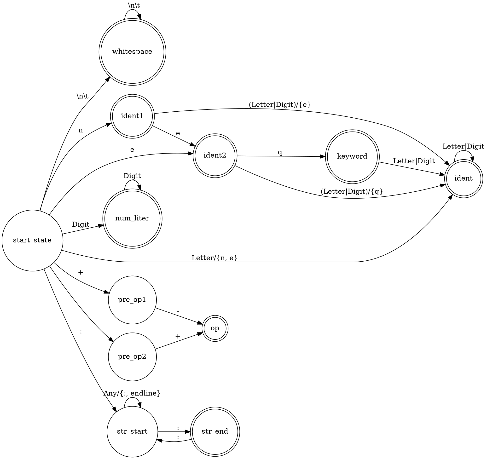

% Лабораторная работа № 1.4 «Лексический распознаватель»
% 25 марта 2024 г.
% Андрей Марченко, ИУ9-62Б

# Цель работы
Целью данной работы является изучение использования детерминированных конечных автоматов с 
размеченными заключительными состояниями (лексических распознавателей) для решения задачи 
лексического анализа.

# Индивидуальный вариант
eq, neq, +-, -+, строковые литералы ограничены знаками :, для включения двоеточия в строку
оно удваивается, не могут пересекать границы строк текста.

# Реализация

Лексическая структура языка — регулярные выражения для доменов:

* …
* …

Граф детерминированного распознавателя:



Реализация распознавателя:

Файл `Position.java`:
```java
…
```

Файл `Token.java`:
```java
…
```

Файл `Scanner.java`:
```java
…
```

…

# Тестирование

Входные данные

```
…
```

Вывод на `stdout`

```
…
```

# Вывод
‹пишете, чему научились›