% Лабораторная работа № 2.3 «Синтаксический анализатор на основе
  предсказывающего анализа»
% 15 апреля 2024 г.
% Андрей Марченко, ИУ9-62Б

# Цель работы
Целью данной работы является изучение алгоритма построения таблиц предсказывающего анализатора.

# Индивидуальный вариант
```
# ключевые слова
# начинаются с кавычки

F  -> "n" 'or "(" E ")" 'end
T  -> F T1 'end
T1 -> "*" F T1 'or 'epsilon 'end
'axiom E  -> T E1 'end
E1 -> "+" T E1 'or 'epsilon 'end
```

# Реализация

## Неформальное описание синтаксиса входного языка

Язык представляет собой правила переписывания, которые заканчиваются ключевым словом 'end
В левой части может быть либо нетерминал, либо нетеримал с ключевым словом 'axiom.
В правой части - варианты переписыания, состоящие из нетерминалов, строковых литералов
и ключевого слова 'epsilon. Правые части могут разделяться ключевым словом 'or

## Лексическая структура

```
KEY_WORD_EPS ::= 'epsilon
KEY_WORD_AXIOM ::= 'axiom
KEY_WORD_OR ::= 'or
KEY_WORD_END ::= 'end
STR_TERM ::= "[^"\s]"
NONTERM ::= [A-Z][A-Z0-9]*
ARROW ::= '->'
```

## Грамматика языка
```
PROGRAM ::=  RULE PROGRAM | eps
RULE ::= LEFT ARROW RIGHT KEY_WORD_END

LEFT ::= LEFT_1 | LEFT_2
LEFT_1 ::= KEY_WORD_AXIOM NONTERM
LEFT_2 ::= NONTERM

RIGHT ::= PART_RIGHT ALTERNATIVE
ALTERNATIVE ::= KEY_WORD_OR PART_RIGHT ALTERNATIVE | eps
PART_RIGHT ::= SYMB PART_RIGHT2 | KEY_WORD_EPS
PART_RIGHT2 ::= SYMB PART_RIGHT2 | eps
SYMB ::= STR_TERM | NONTERM
```

## Программная реализация

```python
import re

PROGRAM = "PROGRAM"
RULE = "RULE"
LEFT = "LEFT"
LEFT_1 = "LEFT 1"
LEFT_2 = "LEFT 2"
RIGHT = "RIGHT"
ALTERNATIVE = "ALTERNATIVE"
PART_RIGHT = "PART_RIGHT"
PART_RIGHT1 = "PART_RIGHT1"
PART_RIGHT2 = "PART_RIGHT2"
SYMB = "SYMB"

KEY_WORD_EPS = "KEY_WORD_EPS"
KEY_WORD_AXIOM = "KEY_WORD_AXIOM"
KEY_WORD_OR = "KEY_WORD_OR"
KEY_WORD_END = "KEY_WORD_END"
STR_TERM = "STR_TERM"
NONTERM = "NONTERM"
ARROW = "ARROW"
END = "END"


class Token:
    def __init__(self, token_type, value="-1", line=-1, position=-1):
        self.token_type = token_type
        self.value = value
        self.line = line
        self.position = position

    def __str__(self):
        return self.token_type + " " + str(self.value)


class Lexer:
    def __init__(self, text):
        self.text = text
        self.line = 1
        self.position = 1
        self.tokens = []
        self.rules = [
            ('END', r'\$'),
            ('SPACE', r'\s+'),
            ('KEY_WORD_EPS', r'\'epsilon'),
            ('KEY_WORD_AXIOM', r'\'axiom'),
            ('KEY_WORD_END', r'\'end'),
            ('KEY_WORD_OR', r'\'or'),
            ('KEY_WORD_END', r'\'end'),
            ('ARROW', r'->'),
            ('STR_TERM', r'\"[^\"\s]+\"'),
            ('NONTERM', r'[A-Z][A-Z0-9]*'),
            ('COMMENT', r'#.*$')
        ]

    def tokenize(self):
        lines = self.text.splitlines()
        for line_num, line in enumerate(lines):
            self.position = 1
            self.line = line_num + 1
            while self.position < len(line) + 1:
                for rule in self.rules:
                    match = re.match(rule[1], line[self.position - 1:])
                    if match:
                        if rule[0] != 'SPACE' and rule[0] != 'COMMENT':
                            value = match.group()
                            self.tokens.append(Token(rule[0], value, self.line, self.position))
                        self.position += match.end()
                        break
                else:
                    for token in self.tokens:
                        print(token)
                    print(f'lexer error ({self.line}, {self.position})\n')
                    raise ValueError

        return iter(self.tokens)


class TreeNode:
    num = 0

    def __init__(self, content: Token):
        TreeNode.num += 1
        self.num = TreeNode.num
        self.content = content
        self.children = []

    def replace_name(self, name):
        for child in self.children:
            if child.content.token_type == STR_TERM:
                child.content.token_type = name
                break

    def add_child(self, child):
        self.children.append(child)

    def __repr__(self):
        return str(self.content)

    def print_graph(self, f):
        f.write(f'{self.num} [label = "{str(self.content.token_type)}"]\n')
        for child in self.children:
            f.write(f'{self.num} -> {child.num}\n')
        for child in self.children:
            child.print_graph(f)


class Predicter:
    def __init__(self, token_iterator):
        self.magazine = []
        self.terminals = [ARROW, KEY_WORD_END, KEY_WORD_AXIOM, 
                          NONTERM, KEY_WORD_OR, KEY_WORD_EPS, STR_TERM, END]
        self.nonterminals = [PROGRAM, RULE, LEFT, LEFT_1, LEFT_2, RIGHT, 
                             ALTERNATIVE, PART_RIGHT, PART_RIGHT2, SYMB]
        self.tokens = token_iterator
        self.table = {
            (PROGRAM, KEY_WORD_AXIOM): [RULE, PROGRAM],
            (PROGRAM, NONTERM): [RULE, PROGRAM],
            (PROGRAM, END): [],

            (RULE, KEY_WORD_AXIOM): [LEFT, ARROW, RIGHT, KEY_WORD_END],
            (RULE, NONTERM): [LEFT, ARROW, RIGHT, KEY_WORD_END],

            (LEFT, KEY_WORD_AXIOM): [LEFT_1],
            (LEFT, NONTERM): [LEFT_2],

            (LEFT_1, KEY_WORD_AXIOM): [KEY_WORD_AXIOM, NONTERM],
            (LEFT_2, NONTERM): [NONTERM],

            (RIGHT, NONTERM): [PART_RIGHT, ALTERNATIVE],
            (RIGHT, KEY_WORD_EPS): [PART_RIGHT, ALTERNATIVE],
            (RIGHT, STR_TERM): [PART_RIGHT, ALTERNATIVE],

            (ALTERNATIVE, KEY_WORD_OR): [KEY_WORD_OR, PART_RIGHT, ALTERNATIVE],
            (ALTERNATIVE, KEY_WORD_END): [],

            (PART_RIGHT, NONTERM): [SYMB, PART_RIGHT2],
            (PART_RIGHT, KEY_WORD_EPS): [KEY_WORD_EPS],
            (PART_RIGHT, STR_TERM): [SYMB, PART_RIGHT2],

            (PART_RIGHT2, NONTERM): [SYMB, PART_RIGHT2],
            (PART_RIGHT2, STR_TERM): [SYMB, PART_RIGHT2],
            (PART_RIGHT2, KEY_WORD_END): [],
            (PART_RIGHT2, KEY_WORD_OR): [],

            (SYMB, NONTERM): [NONTERM],
            (SYMB, STR_TERM): [STR_TERM],
        }

    def top_down_parse(self):
        self.magazine.append(TreeNode(Token(END)))
        root = TreeNode(Token(PROGRAM))
        self.magazine.append(root)
        a = next(self.tokens)
        result = []
        cur_x = None
        while True:
            x = self.magazine[-1]
            if x.content.token_type == END:
                break
            if x.content.token_type in self.terminals:
                if x.content.token_type == a.token_type:
                    cur_x.replace_name(a.value.replace("\"", "\\\""))
                    self.magazine.pop()
                    a = next(self.tokens)
                else:
                    raise ValueError(f"Problem with token {a.token_type}: {a.value}")

            elif (x.content.token_type, a.token_type) in self.table:
                self.magazine.pop()
                new_nodes = []
                for i in range(len(self.table[(x.content.token_type, a.token_type)])):
                    new_nodes.append(TreeNode(Token(self.table[(x.content.token_type, a.token_type)][i])))
                if len(new_nodes) == 0:
                    x.add_child(TreeNode(Token("epsilon")))
                for y in new_nodes:
                    cur_x = x
                    x.add_child(y)
                for y in new_nodes[::-1]:
                    self.magazine.append(y)
                result.append((x.content, self.table[(x.content.token_type, a.token_type)]))
            else:
                raise ValueError(f"Problem with token {a.token_type}: {a.value}")
        return root


if __name__ == "__main__":
    with open('test.txt', 'r') as f:
        text = f.read()
    lexer = Lexer(text + "$")
    try:
        iterator = lexer.tokenize()
        predicter = Predicter(iterator)
        root = predicter.top_down_parse()
        with open('graph.dot', 'w') as f:
            f.write('digraph {\n')
            root.print_graph(f)
            f.write('}')
    except ValueError as v:
        print(v)
```

# Тестирование

Входные данные

```
F  -> "n" 'or "(" E ")" 'end # wereewrew
#SDFsdf
T  -> F T1 'end
T1 -> "*" F T1 'or 'epsilon 'end
'axiom E  -> T E1 'end
E1 -> "+" T E1 'or 'epsilon 'end
```

Вывод на `stdout`

```dot
digraph {
2 [label = "PROGRAM"]
2 -> 3
2 -> 4
3 [label = "RULE"]
3 -> 5
3 -> 6
3 -> 7
3 -> 8
5 [label = "LEFT"]
5 -> 9
9 [label = "LEFT 2"]
9 -> 10
10 [label = "NONTERM"]
6 [label = "ARROW"]
7 [label = "RIGHT"]
7 -> 11
7 -> 12
11 [label = "PART_RIGHT"]
11 -> 13
11 -> 14
13 [label = "SYMB"]
13 -> 15
15 [label = "\"n\""]
14 [label = "PART_RIGHT2"]
14 -> 16
16 [label = "epsilon"]
12 [label = "ALTERNATIVE"]
12 -> 17
12 -> 18
12 -> 19
17 [label = "KEY_WORD_OR"]
18 [label = "PART_RIGHT"]
18 -> 20
18 -> 21
20 [label = "SYMB"]
20 -> 22
22 [label = "\"(\""]
21 [label = "PART_RIGHT2"]
21 -> 23
21 -> 24
23 [label = "SYMB"]
23 -> 25
25 [label = "NONTERM"]
24 [label = "PART_RIGHT2"]
24 -> 26
24 -> 27
26 [label = "SYMB"]
26 -> 28
28 [label = "\")\""]
27 [label = "PART_RIGHT2"]
27 -> 29
29 [label = "epsilon"]
19 [label = "ALTERNATIVE"]
19 -> 30
30 [label = "epsilon"]
8 [label = "KEY_WORD_END"]
4 [label = "PROGRAM"]
4 -> 31
4 -> 32
31 [label = "RULE"]
31 -> 33
31 -> 34
31 -> 35
31 -> 36
33 [label = "LEFT"]
33 -> 37
37 [label = "LEFT 2"]
37 -> 38
38 [label = "NONTERM"]
34 [label = "ARROW"]
35 [label = "RIGHT"]
35 -> 39
35 -> 40
39 [label = "PART_RIGHT"]
39 -> 41
39 -> 42
41 [label = "SYMB"]
41 -> 43
43 [label = "NONTERM"]
42 [label = "PART_RIGHT2"]
42 -> 44
42 -> 45
44 [label = "SYMB"]
44 -> 46
46 [label = "NONTERM"]
45 [label = "PART_RIGHT2"]
45 -> 47
47 [label = "epsilon"]
40 [label = "ALTERNATIVE"]
40 -> 48
48 [label = "epsilon"]
36 [label = "KEY_WORD_END"]
32 [label = "PROGRAM"]
32 -> 49
32 -> 50
49 [label = "RULE"]
49 -> 51
49 -> 52
49 -> 53
49 -> 54
51 [label = "LEFT"]
51 -> 55
55 [label = "LEFT 2"]
55 -> 56
56 [label = "NONTERM"]
52 [label = "ARROW"]
53 [label = "RIGHT"]
53 -> 57
53 -> 58
57 [label = "PART_RIGHT"]
57 -> 59
57 -> 60
59 [label = "SYMB"]
59 -> 61
61 [label = "\"*\""]
60 [label = "PART_RIGHT2"]
60 -> 62
60 -> 63
62 [label = "SYMB"]
62 -> 64
64 [label = "NONTERM"]
63 [label = "PART_RIGHT2"]
63 -> 65
63 -> 66
65 [label = "SYMB"]
65 -> 67
67 [label = "NONTERM"]
66 [label = "PART_RIGHT2"]
66 -> 68
68 [label = "epsilon"]
58 [label = "ALTERNATIVE"]
58 -> 69
58 -> 70
58 -> 71
69 [label = "KEY_WORD_OR"]
70 [label = "PART_RIGHT"]
70 -> 72
72 [label = "KEY_WORD_EPS"]
71 [label = "ALTERNATIVE"]
71 -> 73
73 [label = "epsilon"]
54 [label = "KEY_WORD_END"]
50 [label = "PROGRAM"]
50 -> 74
50 -> 75
74 [label = "RULE"]
74 -> 76
74 -> 77
74 -> 78
74 -> 79
76 [label = "LEFT"]
76 -> 80
80 [label = "LEFT 1"]
80 -> 81
80 -> 82
81 [label = "KEY_WORD_AXIOM"]
82 [label = "NONTERM"]
77 [label = "ARROW"]
78 [label = "RIGHT"]
78 -> 83
78 -> 84
83 [label = "PART_RIGHT"]
83 -> 85
83 -> 86
85 [label = "SYMB"]
85 -> 87
87 [label = "NONTERM"]
86 [label = "PART_RIGHT2"]
86 -> 88
86 -> 89
88 [label = "SYMB"]
88 -> 90
90 [label = "NONTERM"]
89 [label = "PART_RIGHT2"]
89 -> 91
91 [label = "epsilon"]
84 [label = "ALTERNATIVE"]
84 -> 92
92 [label = "epsilon"]
79 [label = "KEY_WORD_END"]
75 [label = "PROGRAM"]
75 -> 93
75 -> 94
93 [label = "RULE"]
93 -> 95
93 -> 96
93 -> 97
93 -> 98
95 [label = "LEFT"]
95 -> 99
99 [label = "LEFT 2"]
99 -> 100
100 [label = "NONTERM"]
96 [label = "ARROW"]
97 [label = "RIGHT"]
97 -> 101
97 -> 102
101 [label = "PART_RIGHT"]
101 -> 103
101 -> 104
103 [label = "SYMB"]
103 -> 105
105 [label = "\"+\""]
104 [label = "PART_RIGHT2"]
104 -> 106
104 -> 107
106 [label = "SYMB"]
106 -> 108
108 [label = "NONTERM"]
107 [label = "PART_RIGHT2"]
107 -> 109
107 -> 110
109 [label = "SYMB"]
109 -> 111
111 [label = "NONTERM"]
110 [label = "PART_RIGHT2"]
110 -> 112
112 [label = "epsilon"]
102 [label = "ALTERNATIVE"]
102 -> 113
102 -> 114
102 -> 115
113 [label = "KEY_WORD_OR"]
114 [label = "PART_RIGHT"]
114 -> 116
116 [label = "KEY_WORD_EPS"]
115 [label = "ALTERNATIVE"]
115 -> 117
117 [label = "epsilon"]
98 [label = "KEY_WORD_END"]
94 [label = "PROGRAM"]
94 -> 118
118 [label = "epsilon"]
}
```



# Вывод
В этой лабораторной работе я узнал структуру построения синтаксического анализатора.
Написал реализацию программы предсказывающего анализатора, построил для него таблицу, 
перед этим разобравшись в лексической и синтаксической структурой языка. 
Таким образом, цели лабораторной работы считаю для себя достигнутыми.